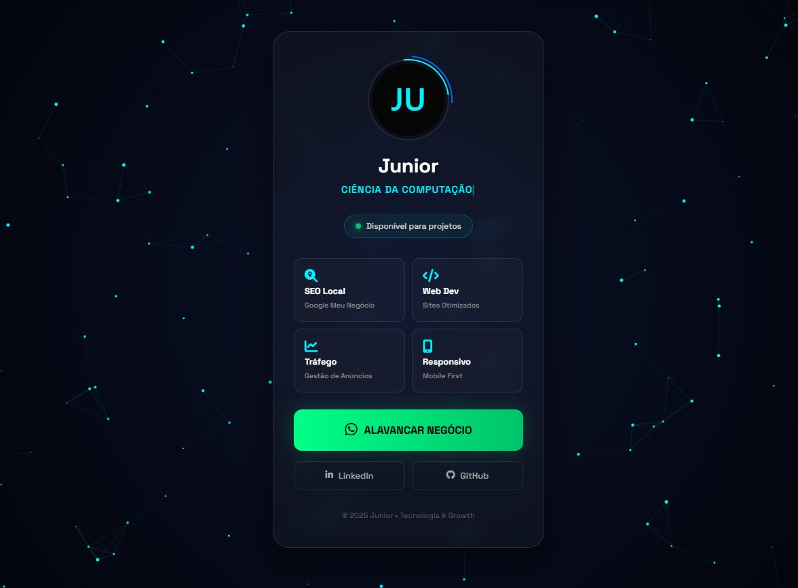

# 🚀 Junior | Digital Solutions

> **Portfólio Pessoal & Hub de Serviços Digitais**
> *Conectando Estratégia de Marketing com Engenharia de Software.*

---

## 💻 Sobre o Projeto

Este repositório hospeda a minha **Landing Page Profissional** (`Junior | Digital Solutions`). 
O objetivo deste projeto não é apenas servir como um cartão de visitas, mas demonstrar domínio em:

* **Front-end Moderno:** Uso de CSS Grid, Flexbox e Animações CSS (Keyframes) sem dependência de frameworks pesados.
* **Performance:** Código limpo e otimizado para carregamento instantâneo em 3G/4G (Mobile First).
* **UI/UX Design:** Estética "Cyberpunk/Dark Mode" focada em retenção visual e hierarquia de informação.
* **Conversão:** Estrutura pensada para direcionar o visitante para o WhatsApp (CTA).

---

## 🎨 Preview

---

## 🛠 Tecnologias Utilizadas

Para garantir leveza e controle total sobre o design, utilizei a "Tríade Web" pura:

*  **Semântico**: Para melhor SEO e Acessibilidade.
*  **Avançado**: Variáveis (:root), Glassmorphism, Gradients e Animações.
*  **Icons**: Para identidade visual dos serviços.

---

## ⚡ Funcionalidades

- [x] **Tema Dark/Cyberpunk:** Conforto visual e estética moderna.
- [x] **Responsividade Total:** Adapta-se de celulares pequenos a monitores ultrawide.
- [x] **Links Biográficos:** Centralização de GitHub, LinkedIn e WhatsApp.
- [x] **Animações de Performance:** Uso de `transform` e `opacity` para não travar em dispositivos antigos.

---

## 🚀 Como acessar

Você pode visualizar o projeto rodando em tempo real através do GitHub Pages:

🔗 **[Acessar Junior | Digital Solutions](eutitotech.github.io/CartaoDeVisita-TitoCartaoDeVisita-Tito)**

---

## 📞 Contato & Contratação

Estou disponível para projetos de desenvolvimento web e consultoria de SEO em Ibirité/MG e remoto.

* **Instagram:** [@eutito.tech](https://instagram.com/eutito.tech)
* **LinkedIn:** [Seu Perfil](https://linkedin.com/in/adriano-junior-b27066250)
* **GitHub:** [@EuTitoTech](https://github.com/EuTitoTech)

---

  Desenvolvido com 💜 e ☕ por <a href="https://github.com/EuTitoTech">Tito</a>

